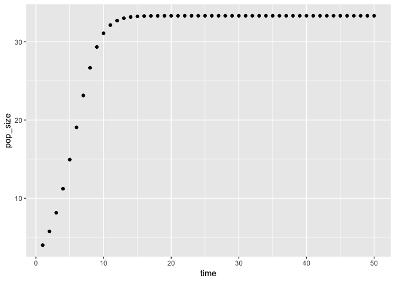

Writing functions with R
================
Vanessa Garcia

``` r
library(tidyverse)
```

    ## ── Attaching packages ───────────────────────────────────────────────────────────────────────────────────────────────────────────────────────────────────────── tidyverse 1.2.1 ──

    ## ✔ ggplot2 3.0.0     ✔ purrr   0.2.5
    ## ✔ tibble  1.4.2     ✔ dplyr   0.7.6
    ## ✔ tidyr   0.8.1     ✔ stringr 1.3.1
    ## ✔ readr   1.1.1     ✔ forcats 0.3.0

    ## ── Conflicts ──────────────────────────────────────────────────────────────────────────────────────────────────────────────────────────────────────────── tidyverse_conflicts() ──
    ## ✖ dplyr::filter() masks stats::filter()
    ## ✖ dplyr::lag()    masks stats::lag()

Learning to write our own functions in R

$$x\_{t+1} = r x \_t \\left (1-  \\frac{x\_t}{K} \\right)$$

**Now we want to rewrite the function in code which is happening below **

``` r
growth<- function(xt, r, K) {
  
  (r*xt) *(1-(xt/K))
  
}
  #growth(xt =1, r = 2, K=1)
```

``` r
  simulate<- function(max_time, x0 , r, K ){
  
    #r is the birth rate

  x <- numeric(max_time)
  #creates an empty number vector 
  x
  x[1] <- x0  # setting first data point to x1 =100
  
  for (t in 1: (max_time-1)) {
    
    
   x[t + 1] <-growth (xt = x[t] , r = r,  K=K)
  }
  
     #loop
  
  pop_data <- data_frame(time = 1:max_time, pop_size = x)
  pop_data
  #creates dataframe with the created variables
}
```

``` r
simulate(max_time = 50, x0 = 4, r = 1.5, K =100)%>%
ggplot(aes(time, pop_size))+
  geom_point()
```


